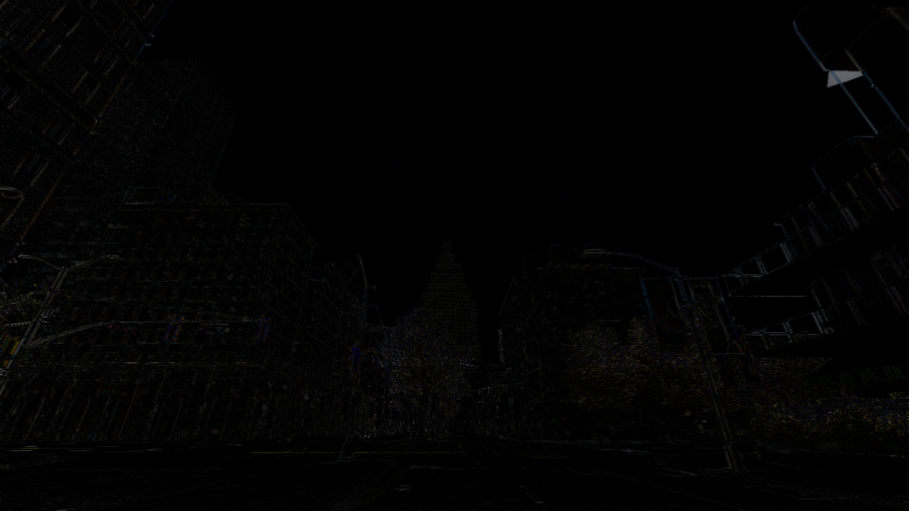
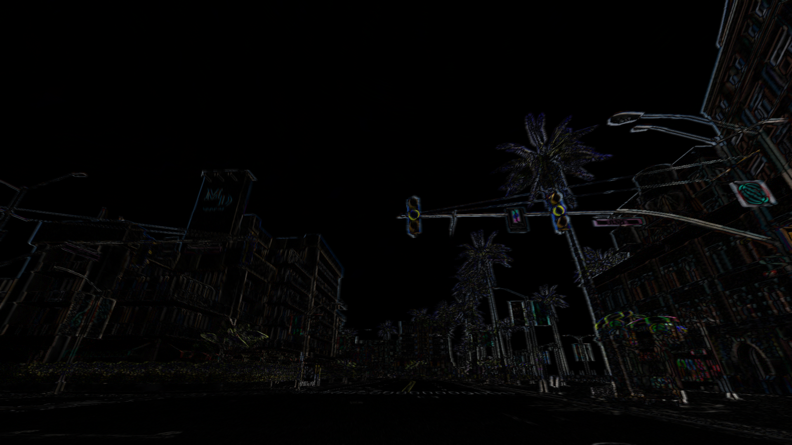
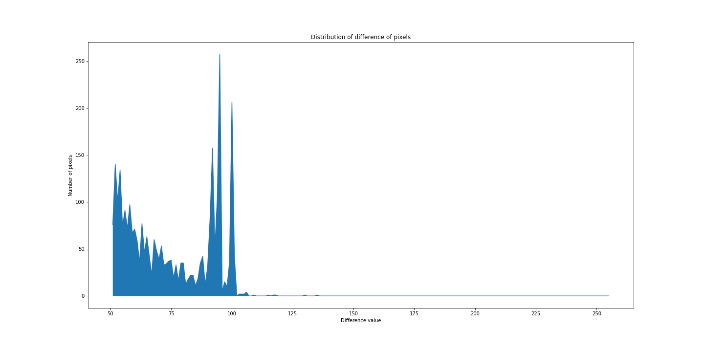
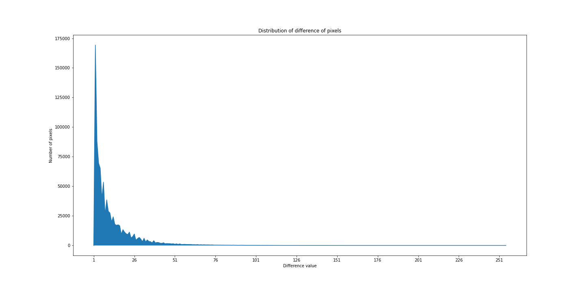
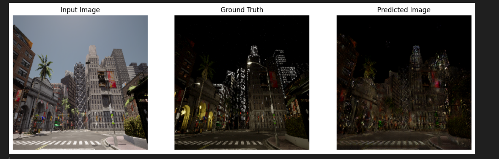

Generating pairs of images using the CARLA Simulator.

**Authors**: Hamza Benmendil, Omar Khalifa Arif

To generate pairs of images (day/night, also semantic images), we are using the CARLA Simulator v0.9.12, an open-source simulator for autonomous driving cars.

## Pre-requirements
- CARLA Simulator (requires a GPU with at least 6 GB of memory).
- Python (>=3 recommended).
- Install dependencies using: `python install -r requirements.txt`.

## Execution and Image Generation
You'll notice that there are two scripts: `record_scenario.py` and `replay_scenario.py`. Copy and paste them into the directory `PythonAPI/examples/` from the CARLA simulator root directory.

To generate the images, you need to:

1. Execute the CARLA server.
2. Change the map if you want to, using the script `config.py` (refer to CARLA Simulator documentation).
3. Execute the `record_scenario.py` file; it will spawn an autopilot car, record its path, and save it in a log file. To choose the name of the file, add the option `--file [filename]` to the execution command (default: `recording.log`).
4. Execute the `replay_scenario.py` file; it will replay the given scenario in day or night and capture RGB and semantic images every 20 frames until capturing 100 images. The images are stored in a directory called `data`. The script can be executed with the following options:
   - `--file [filename]` to replay the scenario in a specific file (default is `recording.log`).
   - `--night [True/False]` to replay the scenario at night or during the day (default is `False`, indicating day).
   - `--width [int]` the width of the captured images (default is 1920).
   - `--height [int]` the height of the captured images (default is 1080).

To execute a pair of images (day/night), you need to record a scenario once, then replay it twice—once with the night option and once without it.

## Comparison of Images
You'll also find a notebook called `compare_images.ipynb`; it is used to compare generated images by CARLA and see if a pair of images under the same conditions are identical.

We generated two sets of images from two different executions of the `replay_scenario.py` file under the same conditions (both during the day) using the same scenario. Then, we constructed a difference image using the pixel-by-pixel comparison of the compared images.

The output image seems to have a very small number of non-null pixels.

### Difference Images
- **Difference image in frame 17:**
  

- **Difference image in frame 10:**
  

However, we found that approximately 43% of pixels are non-null, which is a significant percentage.

We plotted the distribution of non-zero pixels (for the red color) in the difference image and found that the majority of non-zero pixels have a value less than 25, while the number of pixels that have a value between 50 and 100 peaked at 250 pixels, which is very negligible.

- **Distribution frame 17:**
  

- **Distribution frame 17 from 50:**
  

We found the same shape of distribution for another difference image (frame 10).

- **Distribution frame 10:**
  

## Day/Night Image Translation Using GAN

In addition to generating paired day/night images with the CARLA simulator, this project incorporates a machine learning approach for day-to-night image translation using Generative Adversarial Networks (GANs). Specifically, the implementation is provided in the `DayNightNN.ipynb` notebook, which is based on the **Pix2Pix** framework, a popular conditional GAN architecture designed for paired image-to-image translation tasks.

### Model Overview

The model uses the following components:

- **Generator (U-Net Architecture)**: The generator transforms daytime images into nighttime images. It is built using a U-Net architecture, which features skip connections between the encoder and decoder layers. These connections help retain low-level details from the input image, improving the quality of the generated images.
  
- **Discriminator (PatchGAN)**: The PatchGAN discriminator evaluates the realism of the generated night images by breaking them into patches and classifying each patch as real or fake. This approach helps the model focus on local details, ensuring high-quality translations.

### Training Process

The GAN model is trained using pairs of corresponding day and night images generated from the CARLA simulator. The generator attempts to produce night images from daytime inputs, while the discriminator learns to distinguish between real night images and the generated ones. Through adversarial training, the generator improves over time, producing increasingly realistic night images.

- **Loss Functions**: 
  - **Adversarial Loss**: Ensures that the generated images become increasingly indistinguishable from real night images.
  - **L1 Loss**: Enforces pixel-level similarity between the generated and real images, which helps the model maintain structural consistency.

### Results and Applications

The trained model can be used to automatically convert daytime driving scenarios into realistic nighttime scenes.

